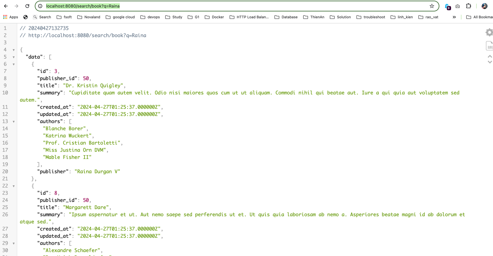

# Test Description
## Search
Assume that you're being hired by BookReader company which is a book marketplace and has millions of books and audiobooks from publishers worldwide. Please develop an application with Laravel that provides a search API for end-users. It is essential for the business so their customers can find their books in a reasonable amount of time.

- The system should have a single api endpoint like <http://bookreaders.com.au/search/book?q={keyword}>
- The `keyword` can be a `title`, `summary`, `publisher`, or `authors`.
- The final JSON data model for a response should contain these values:

```json
{
    "id": 1234,
    "publisher": "Some Fancy Publisher",
    "title": "Mastering Something",
    "summary": "Long summary",
    "authors": [
        "Lovely Author One",
        "Lovely Author Two"
    ]
}
```

- The code should function properly and include tests to ensure its correctness.
- Dockerize your project and ensure that it works out of the box.
- Catch all edge cases and aim for the best run-time possible.
- You are free to use any architecture, design, and implementation method, but not external on-premise or cloud services.
- The code serves as our source of truth for assessing your expertise, so please showcase your best work.

Enjoy Coding :)

# Require
- Docker
- Docker Compose
- Device use chip Intel or AMD not ARM

## Run Source Code
```
- docker-compose up -d
- docker exec -it db-mysql bash // (access container to restore db)
- mysql -u root -p < /opt/database/db_exam.sql // (password: admin)
- click: ctrl + p + q // (exit container after restore db)
- docker exec -it web composer install
- docker exec -it web cp -r opt/docker/patch/SearchableListFactory.php vendor/matchish/laravel-scout-elasticsearch/src/Searchable/SearchableListFactory.php
- docker restart jobs
- docker exec -it web php artisan scout:import
```

## Run seeder if don't wanna use database example:
```
docker exec -it web php artisan migrate
docker exec -it web php artisan db:seed
```

## Run index
```docker exec -it web php artisan scout:import```
## Run unit test
```docker exec -it web php artisan test```

## Result:
http://localhost:8080/search/book?q=Raina


